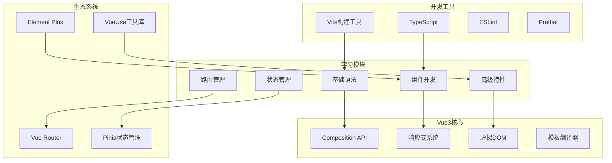

# 🎨 st-vue3 - Vue3学习项目


## 📖 项目简介

st-vue3是Vue3技术栈的系统性学习项目,涵盖Composition API、响应式原理、组件化开发、状态管理等核心内容,从基础到实战全面掌握Vue3。

## 🏗️ 系统架构



## 📚 学习路径

### 第一阶段: 基础入门

- **Vue3简介**: 新特性、优势
- **Composition API**: setup、ref、reactive
- **响应式原理**: Proxy、依赖收集
- **生命周期**: 钩子函数

### 第二阶段: 组件开发

- **组件基础**: Props、Emits、Slots
- **组件通信**: 父子、兄弟、跨层级
- **组件进阶**: 动态组件、异步组件
- **自定义指令**: v-model、v-show

### 第三阶段: 路由状态

- **Vue Router**: 路由配置、导航守卫
- **Pinia**: Store、Actions、Getters
- **持久化**: 本地存储、会话存储

### 第四阶段: 高级特性

- **Teleport**: 传送门组件
- **Suspense**: 异步组件加载
- **自定义渲染器**: Canvas、WebGL
- **性能优化**: 懒加载、虚拟滚动

## 🚀 快速开始

```bash
# 克隆项目
git clone https://github.com/yourusername/st-vue3.git

# 安装依赖
npm install

# 启动开发服务器
npm run dev

# 构建生产版本
npm run build
```

## 💡 核心示例

### Composition API

```vue
<template>
  <div>
    <p>Count: {{ count }}</p>
    <p>Double: {{ double }}</p>
    <button @click="increment">Increment</button>
  </div>
</template>

<script setup lang="ts">
import { ref, computed } from 'vue'

// 响应式数据
const count = ref(0)

// 计算属性
const double = computed(() => count.value * 2)

// 方法
const increment = () => {
  count.value++
}
</script>
```

### 响应式系统

```typescript
import { reactive, effect } from 'vue'

// 响应式对象
const state = reactive({
  count: 0,
  user: {
    name: 'John',
    age: 30
  }
})

// 副作用函数
effect(() => {
  console.log('Count changed:', state.count)
})

// 修改数据触发副作用
state.count++
```

### 组件通信

```vue
<!-- 父组件 -->
<template>
  <ChildComponent
    :message="message"
    @update="handleUpdate"
  >
    <template #default>
      <p>插槽内容</p>
    </template>
  </ChildComponent>
</template>

<script setup>
import { ref } from 'vue'
import ChildComponent from './ChildComponent.vue'

const message = ref('Hello')

const handleUpdate = (newValue) => {
  message.value = newValue
}
</script>
```

### Pinia状态管理

```typescript
// store/user.ts
import { defineStore } from 'pinia'

export const useUserStore = defineStore('user', {
  state: () => ({
    name: '',
    age: 0
  }),
  
  getters: {
    isAdult: (state) => state.age >= 18
  },
  
  actions: {
    setUserInfo(name: string, age: number) {
      this.name = name
      this.age = age
    }
  }
})

// 使用
const userStore = useUserStore()
userStore.setUserInfo('John', 25)
```

## 📁 项目结构

```
st-vue3/
├── src/
│   ├── basic/               # 基础示例
│   ├── components/          # 组件示例
│   ├── composition/         # Composition API
│   ├── router/              # 路由示例
│   ├── store/               # 状态管理
│   ├── advanced/            # 高级特性
│   └── utils/               # 工具函数
├── examples/                # 完整示例
└── exercises/               # 练习题
```

## 🎯 核心特性

- **响应式系统**: Proxy实现,自动依赖收集
- **Composition API**: 更灵活的代码组织方式
- **TypeScript支持**: 完整的类型推断
- **性能优化**: 静态提升、Tree-shaking
- **DevTools**: Vue DevTools调试工具

## 📝 更新日志

### v1.0.0 (2024-01-01)
- ✨ 初始版本发布
- ✨ 完成基础语法学习
- ✨ 完成组件开发学习
- ✨ 完成路由和状态管理学习

---

⭐ 如果这个项目对你有帮助,欢迎Star支持!
